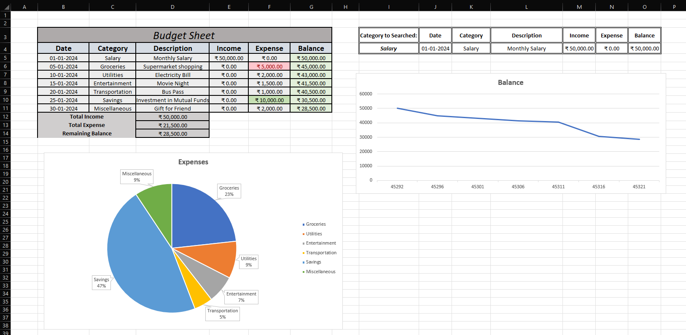

💰 Budget Management Sheet in Excel

A simple and interactive Excel project designed to **track income, expenses, and monitor savings** over time.  
Built to practice financial planning while exploring essential Excel features and data visualization tools.

📌 Features
- ✅ Dynamic Summary: Auto-updates total income, expenses, and remaining balance  
- 🔍 Category Filter: Quickly filter transactions by category  
- 🥧 Pie Chart: Visualize category-wise expense distribution  
- 📈 Line Chart: Track balance trend over time  
- 🧮 Excel Functions Used: `SUM`, `FILTER`, `Data Validation`, cell formatting, chart tools  

📂 Files Included
- `Personal_Budget_Tracker_Excel.xlsx` – Main budget sheet  
- `README.md` – Project documentation  
- `/BudgetSheet_Preview` – Screenshots and visuals from the project  

🎯 Key Learnings
- Enhanced **Excel formatting and formula writing**
- Applied a **real-world use case** of financial planning
- Gained experience in **data visualization** within Excel
- Practiced **clean layout design** and usability

🔹 Preview

📬 Feedback or suggestions? I’d love to hear from you!
